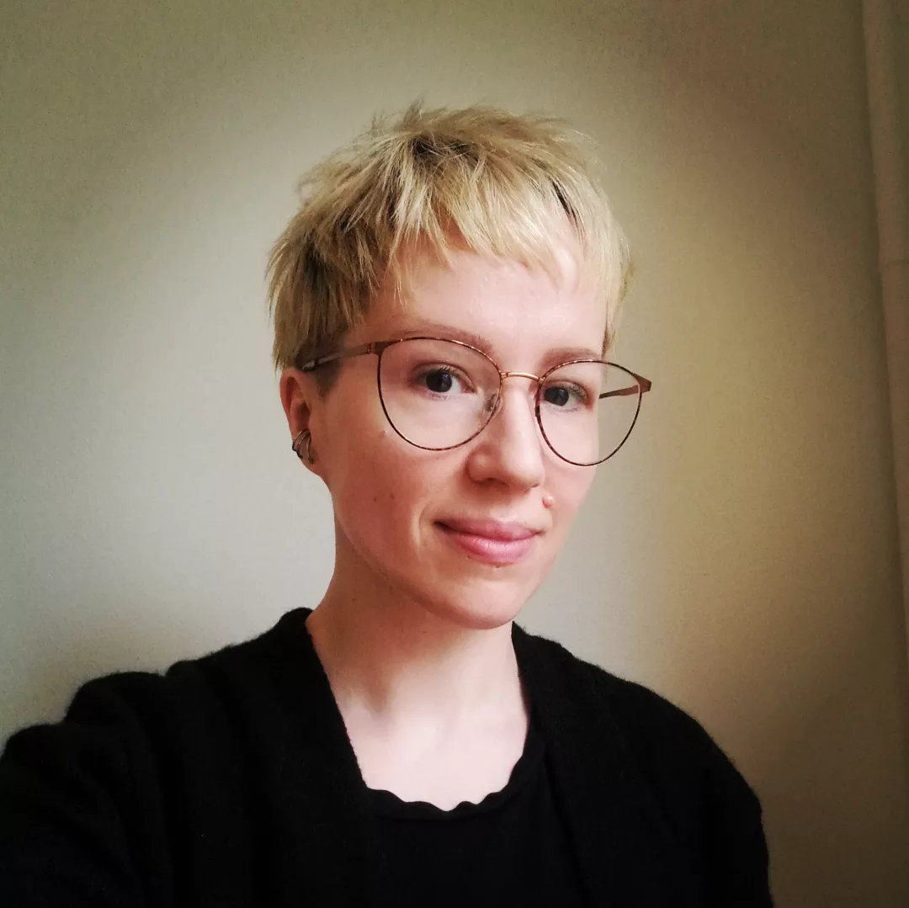

## [SciLifeLab PULSE Training]{.large}
### Not your average postdoctoral program
:::{style="margin-bottom:1em;"}

:::

PULSE has been specifically designed to connect early-career researchers with opportunities and skills that support long-term career sustainability across sectors. To meet this goal, the PULSE training program has been developed using the [European Competency Framework for Researchers (ResearchComp)](https://research-and-innovation.ec.europa.eu/jobs-research/researchcomp-european-competence-framework-researchers_en). As such, being or hosting a PULSE postdoc has specific requirements that differ from some traditional postdoctoral training programs.

The PULSE Training website hosts training modules developed for the PULSE postdocs. For more information on the program, visit the [SciLifeLab PULSE Page](https://www.scilifelab.se/research/pulse/)

{height="1.5em"} &nbsp;   {height="1.5em" style="margin-bottom:-3px;"}

## PULSE Training and Career Development Committee

::: {.profile-parent}
::: {.profile-child}

{.nolightbox}

[Jessica Lindvall]()  
PULSE Training Director

:::
::: {.profile-child}

{.nolightbox}

[Kristen Schroeder]()  
Training Coordinator, Transferrable Skills Training

:::
::: {.profile-child}

{.nolightbox}

[Anna Ridderstad Wollberg]()  
Training Coordinator, Entrepreneurial Track

:::
:::

The PULSE Training and Career Development Committee develops and coordinates PULSE training, in collaboration with the [PULSE Program Office](https://www.scilifelab.se/research/pulse/faq-contacts/) and the PULSE Management Group. 

To reach the TCDC, write to us at **pulse.training[at]scilifelab.se**.  
For all other inquiries, contact the PULSE program office at **pulse[at]scilifelab.se**.

---

 N.B. PULSE is funded by the European Union. Views and opinions expressed are however those of the author(s) only and do not necessarily reflect those of the European Union or the European Research Executive Agency. Neither the European Union nor the granting authority can be held responsible for them.  
The modules of <a href="https://scilifelab-training.github.io/PULSE/0001/">SciLifeLab PULSE Training</a> are licensed under <a href="https://creativecommons.org/licenses/by-nc-sa/4.0/">CC BY 4.0</a>

{height="1.1em"} &nbsp; [](https://bsky.app/profile/scilifelab.se) &nbsp; [](https://www.linkedin.com/company/scilifelab/) &nbsp; [](https://github.com/SciLifeLab-Training/PULSE)  
