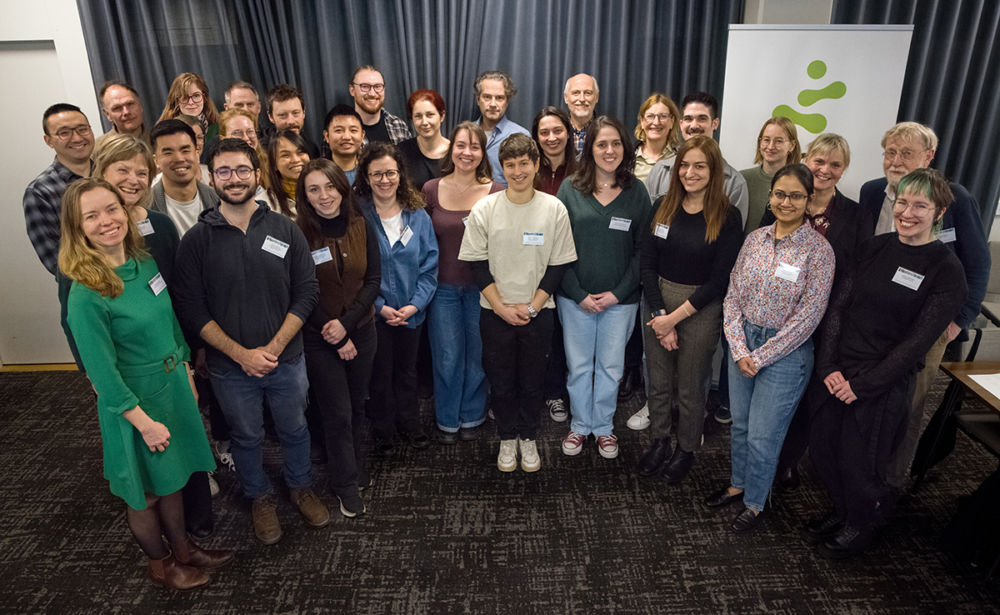

## Annual Meeting 2026

{group="PULSE-2026"}

<!--
::: {.raukr-gallery-parent}
::: {.raukr-gallery-child}
{group="raukr-2024"}
:::
::: {.raukr-gallery-child}
{group="raukr-2024"}
:::
::: {.raukr-gallery-child}
{group="raukr-2024"}
:::
::: {.raukr-gallery-child}
{group="raukr-2024"}
:::
::: {.raukr-gallery-child}
{group="raukr-2024"}
:::
::: {.raukr-gallery-child}
{group="raukr-2024"}
:::
::: {.raukr-gallery-child}
{group="raukr-2024"}
:::
::: {.raukr-gallery-child}
{group="raukr-2024"}
:::
::: {.raukr-gallery-child}
{group="raukr-2024"}
:::
::: {.raukr-gallery-child}
{group="raukr-2024"}
:::
::: {.raukr-gallery-child}
{group="raukr-2024"}
:::
::: {.raukr-gallery-child}
{group="raukr-2024"}
:::
::: {.raukr-gallery-child}
{group="raukr-2024"}
:::
::: {.raukr-gallery-child}
{group="raukr-2024"}
:::
:::

 
-->
