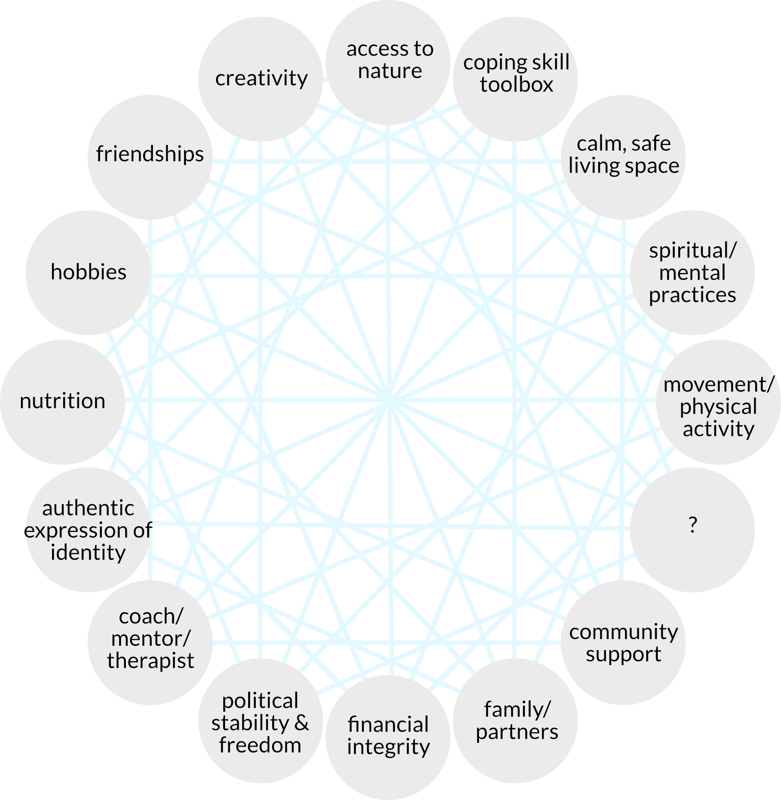

::: {.callout-tip collapse="false"}

## ResearchComp competencies developed in this session

### Self-Management

```{=html}
<table>
    <tr>
        <th>Intermediate</th>
        <th>Advanced</th>
    <tr>
        <th colspan="2" style="background-color: #A6CBCF">4. Cope with pressure</th>
    </tr>
    <tr>
        <td>• Manages challenges and makes decisions under uncertainty<br>
        • Endures setbacks and failures<br>
        • Demonstrates high tolerance for stress and pressure</td>
        <td>• Develops strategies for dealing with uncertainty and adversity<br>
        • Assists others in challenging and adverse situations<br>
        • Comfortably makes decisions based on limited information when necessary</td>
    </tr>
</table>
```


**Note** since all PULSE postdocs have practiced the Foundational competencies by the nature of this program's mobility requirement, this session deals with ResearchComp competencies at the Intermediate/Advanced level.

:::

## Learn
Watch the following interview with Dr. Linda Kvastad, co-founder of [The Coaching in Science Initiative](https://www.thecoachinginscienceinitiative.org) and postdoctoral fellow at the Karolinska Institute.

<p align="center"><iframe width="560" height="315" src="https://youtu.be/Ne4HV3linvU" title="YouTube video player" frameborder="0" allow="accelerometer; autoplay; clipboard-write; encrypted-media; gyroscope; picture-in-picture; web-share" referrerpolicy="strict-origin-when-cross-origin" allowfullscreen></iframe></p>

## Practice

::: {.callout-note}

The work of this practice exercise should take a maximum of 1 hour.

:::

#### Step 1 - Your ecosystem of support

The ResearchComp framework lists enduring failures and having a high tolerance for stress as competencies. Being able to do this requires individual researchers to have good, strong support. 

Below is a representation of a support ecosystem or web, where different relationships, skills, and environment combine to support an individual's wellbeing:

{height="500px" fig-align="center"}

- Which nodes of this web are the strongest for you? 
- What makes them strong supports? 
- Is there any node you would like to be stronger?
- For the node of Coping Skills Toolbox, what kind of support have you developed here?

::: {.callout}
Some examples of coping tools you may have encountered:

- Journalling, for example [Struthless's VOMIT system](https://youtu.be/XJa7sE5Q1QA?si=DWZKoIcjd1KQRun_)
- Guided meditations
- Setting and maintaining [clear boundaries](https://www.thecoachinginscienceinitiative.org/boundary-setting)
- Mindfulness or other parasympathetic nervous system practices
- Regular movement, exercise, or engagement with hobbies and/or community activites
:::

#### Step 2 - Coping with stress in teams
In the interview, Linda speaks about how the research team is a resource to draw on for mental strength in uncertain research projects[^1]. [The Coaching in Science Initiative](https://www.thecoachinginscienceinitiative.org) has recently delivered workshops on psychological safety in teams, and cites the work of [Dr. Amy C. Edmonson](https://amycedmondson.com/psychological-safety/). In conditions of high uncertainty and high interdependence, Edmonson talks about how creating an environment with psychological safety is crucial for excellence[^2].

[^1]: See the [Project Management](session2.qmd) webinar for more on planning for uncertainty.
[^2]: See [Dr. Edmonson's TEDx Talk](https://youtu.be/LhoLuui9gX8?si=NFNVoqiXBMb4mw31) for a short primer on psychological safety.

Take an inventory of how you contribute to a psychologically safe team by answering the following questions:

1. How comfortable are you with acknowledging the uncertainty of research?

2. How comfortable are you with acknowledging your falliability?

3. How comfortable are you with you asking questions and expressing curiosity? 

#### Step 3 - Hypothetical situation
A lab with a highly competitive culture sends Steve, a PhD student at the peak of their fourth year PhD-induced stress to work with you in a lab exchange. You are leading this project, and two bachelor's students from your own group, Francisco and Xiaobei, will be working on the project with you.

- In a short writing piece (less than one page), describe what actions could you take to help build an environment of psychological safety when leading this new collaboration? 

::: {.callout-tip}
If you're stuck, think of how data would be shared, contributions would be acknowledged, how you would hold progress meetings, and what behaviours you would model when you or one of the students makes a mistake!
:::

## Discuss
-	At the webinar, your facilitators will lead a discussion about your experience of this exercise.
- If you are facilitating, please take a look at the [Facilitation Guide](https://nextcloud.dc.scilifelab.se/s/N2jT29zZaFe3qyc).

## Next level
#### Three (optional!) exercises for coping with stress
If you're interested in deepening your practice of stress management, here are three additional exercises:

1. Watch [Anna Månberg's CSI Seminar](https://youtu.be/e_ZToVdzZYY?si=mgMuuNzvwJBwgItx) on the balance between stress and recovery, and her own experience of burnout. 

2. Read [the study](https://doi.org/10.1016/j.jhealeco.2025.103070) (and/or the [University of Gothenburg press release](https://www.gu.se/en/news/sharp-increase-in-psychiatric-medication-among-phd-students)) on the impact of PhD studies on mental health. 

3. Make a list of mental health tools and resources that are available to you, including those from your University, SciLifeLab, and the healthcare system in Sweden. Share it with your lab group and ask for additions.


### Citation
The materials from this session are available for reuse under <a href="https://creativecommons.org/licenses/by/4.0/" rel="CC-BY"></a>

Please cite this material as:

> Kvastad, L. and Schroeder, K. (2026). *SciLifeLab PULSE Transferrable Skills Training Session 4 - Coping with Stress*. Retrieved from https://scilifelab-training.github.io/PULSE/0001/session4.html. DOI: (pending)

If you use this material, we'd love to know! Get in touch with us at pulse.training@scilifelab.se

---
::: small
Module published: Jul 10, 2026
:::